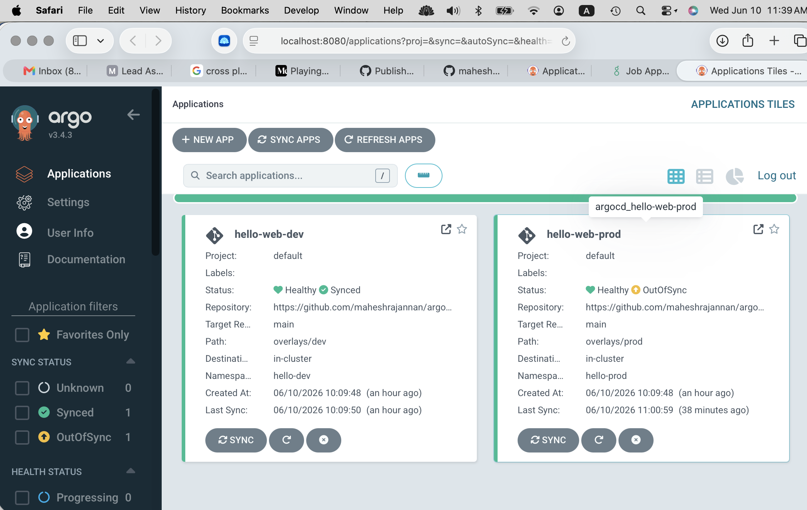
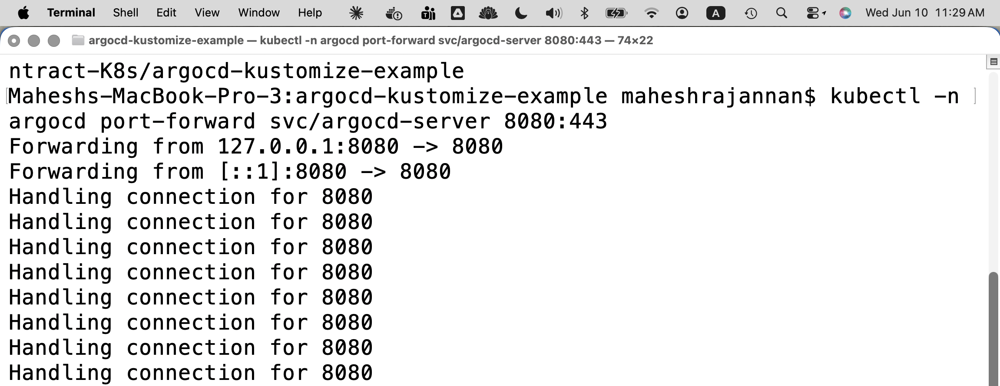
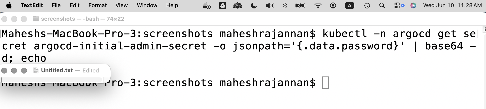

# How to Run

End-to-end run of the ArgoCD + Kustomize demo on a local kind cluster (~10 min). Verified on macOS, 2026-06-10. Concepts and design rationale live in [README.md](README.md).

**Prereqs:** Docker Desktop running, `kind`, `kubectl` (`brew install kind kubectl`). Or just run `./run-demo.sh`, which automates steps 1–3.

## 1. Cluster + ArgoCD

```bash
kind create cluster --name gitops-demo
kubectl create namespace argocd
kubectl apply -n argocd --server-side -f https://raw.githubusercontent.com/argoproj/argo-cd/stable/manifests/install.yaml
kubectl -n argocd wait deploy --all --for=condition=Available --timeout=300s
```

`--server-side` is required: the ApplicationSet CRD is larger than the 256KB `last-applied-configuration` annotation that client-side apply writes. If a partial client-side apply already ran, add `--force-conflicts` to take field ownership. Both failure modes are documented in [issues/issue.md](issues/issue.md).

## 2. Render check (see what ArgoCD will deploy, before any GitOps)

```bash
kubectl kustomize overlays/dev    # 1 replica, dev- prefix, ns hello-dev
kubectl kustomize overlays/prod   # 3 replicas, prod- prefix, + PDB, bigger limits
```

## 3. Register the Applications

```bash
kubectl apply -f argocd/app-dev.yaml -f argocd/app-prod.yaml
kubectl -n argocd get applications -w
```

Expected: `hello-web-dev` → Synced/Healthy on its own (auto-sync). `hello-web-prod` → **stays OutOfSync/Missing — by design** (no automated sync policy); sync it from the UI.

## 4. UI access

In a **separate terminal** (it blocks while running):

```bash
kubectl -n argocd port-forward svc/argocd-server 8080:443
```

Then:

```bash
kubectl -n argocd get secret argocd-initial-admin-secret -o jsonpath='{.data.password}' | base64 -d; echo
```

Open https://localhost:8080 (accept the self-signed cert), login `admin` + that password.

## 5. The two demos that matter

**Demo 1 — drift detection:**

```bash
kubectl -n hello-dev scale deploy dev-hello-web --replicas=5   # manual change = drift
# dev: selfHeal reverts it within seconds — watch it snap back to 1
kubectl -n hello-prod scale deploy prod-hello-web --replicas=1
# prod: goes OutOfSync and STAYS there — a human syncs via PR/UI. Audit trail.
```

**Demo 2 — promotion is a PR:**
Change `replicas: 3 → 4` in `overlays/prod/kustomization.yaml`, commit, push. ArgoCD shows the diff; sync applies it. **Nobody ran kubectl against prod.** That's the whole point.

## Proof it runs (2026-06-10, kind on macOS)

Both Applications live in ArgoCD, showing the two sync postures side by side — dev synced itself; prod is deliberately waiting for a human:



*`hello-web-dev`: **Healthy / Synced** — auto-sync + selfHeal deployed it from `overlays/dev` with no human action. `hello-web-prod`: **OutOfSync / Missing** — correct behavior, not an error: no `automated` sync policy, so ArgoCD renders the diff and waits for an approved sync. The pause is the audit trail.*

The port-forward session serving the UI from the kind cluster:



Retrieving the initial admin credential from the cluster Secret (password redacted):



## Troubleshooting

Real issues hit during the first run, with root causes and fixes: [issues/issue.md](issues/issue.md) (server-side apply CRD size limit; SSA field-manager conflict). Also: `curl -s` hides connection errors while debugging — drop `-s`; `kubectl port-forward` is a foreground process — it dies with its terminal.

## Cleanup

```bash
kind delete cluster --name gitops-demo
```
