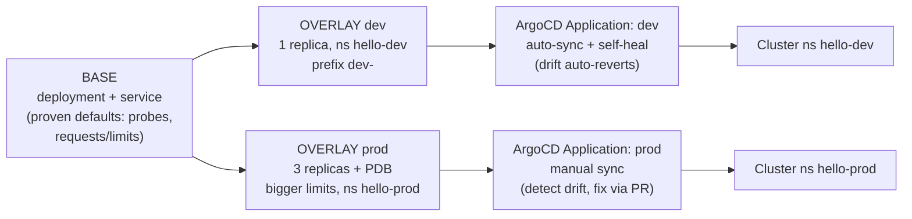

# ArgoCD + Kustomize GitOps — Minimal Working Example

A small, runnable demo of the GitOps pattern Sergei runs at Ecolab: **one Kustomize base, per-env overlays, ArgoCD watching the overlay paths.** Built 2026-06-10 as final-round prep.

## The mental model (say this in the interview)

> "The base is the single source of truth for WHAT the app is. Overlays only declare HOW each environment differs — a patch, never a copy. ArgoCD points at the overlay path, so Git is the deploy interface: promotion is a PR that changes an overlay, and drift is anything the cluster does that Git didn't say."

## Diagram

**Mnemonic: "B-O-A — Base, Overlay, Application — the BOA constrictor that wraps your manifests."** Base = what, Overlay = how-per-env, Application = where ArgoCD delivers it.



## Layout

```
argocd-kustomize-example/
├── base/                      # WHAT the app is
│   ├── deployment.yaml        #   proven defaults: probes, requests/limits
│   ├── service.yaml
│   └── kustomization.yaml
├── overlays/
│   ├── dev/kustomization.yaml     # 1 replica, ns hello-dev, dev- prefix
│   └── prod/                      # 3 replicas, bigger limits
│       ├── kustomization.yaml
│       └── pdb.yaml               # prod-ONLY resource (minAvailable: 2)
└── argocd/
    ├── app-dev.yaml           # auto-sync + selfHeal (dev posture)
    ├── app-prod.yaml          # manual sync = audit-trail posture (GxP instinct)
    └── appset.yaml            # OPTIONAL: Git generator stamps an App per overlays/* dir
```

## Run it (kind, ~10 min)

```bash
# 1. Cluster + ArgoCD
kind create cluster --name gitops-demo
kubectl create namespace argocd
kubectl apply -n argocd --server-side -f https://raw.githubusercontent.com/argoproj/argo-cd/stable/manifests/install.yaml
# --server-side needed: the ApplicationSet CRD is >256KB, too big for the
# last-applied-configuration annotation that client-side apply writes.
kubectl -n argocd wait deploy --all --for=condition=Available --timeout=300s

# 2. See what Kustomize renders BEFORE any GitOps (build confidence first)
kubectl kustomize overlays/dev    # 1 replica, dev- prefix, ns hello-dev
kubectl kustomize overlays/prod   # 3 replicas, prod- prefix, + PDB, bigger limits

# 3. Push this folder to a Git repo, update repoURL in argocd/*.yaml, then:
kubectl apply -f argocd/app-dev.yaml -f argocd/app-prod.yaml

# 4. ArgoCD UI
kubectl -n argocd port-forward svc/argocd-server 8080:443
# password:
kubectl -n argocd get secret argocd-initial-admin-secret -o jsonpath='{.data.password}' | base64 -d
# open https://localhost:8080  (user: admin)
```

## The two demos that matter in the interview

**Demo 1 — drift detection (Sergei's bullet):**
```bash
kubectl -n hello-dev scale deploy dev-hello-web --replicas=5   # manual change = drift
# dev app: selfHeal reverts it within seconds — watch it snap back to 1
kubectl -n hello-prod scale deploy prod-hello-web --replicas=1
# prod app: goes OutOfSync and STAYS there — a human syncs via PR/UI. Audit trail.
```

**Demo 2 — promotion is a PR:**
Change `replicas: 3 → 4` in `overlays/prod/kustomization.yaml`, commit, push. ArgoCD shows the diff; sync applies it. **Nobody ran kubectl against prod.** That's the whole point.

## Talking points this example earns you

1. **Patch, never copy** — base carries proven defaults (probes, requests/limits = my inheritable-baseline instinct from the EKS work); overlays are diffs. No copy-paste divergence between envs.
2. **Sync posture per environment** — dev auto-heals; prod detects-and-alerts with fix-via-PR. That asymmetry is deliberate: in regulated environments the audit trail IS the feature. (GxP carry-over.)
3. **Prod-only resources** — the PDB exists only in the prod overlay. Same base, different operational guarantees.
4. **ApplicationSet as the scale-out** — the optional `appset.yaml` Git generator turns "add a QA env" into "add a directory." Cluster generator = WHERE, Git generator = WHAT, Matrix = both. (Hub-and-Spoke is this idea applied to platform add-ons across clusters.)
5. **Honest framing if probed:** "I ran ArgoCD in production at Takeda with multi-env promotion; my prod GitOps was Helm-and-raw-manifest flavored. I built this Kustomize lab to map my promotion model onto overlays — the model is identical, the patch mechanics are new-but-trivial."
