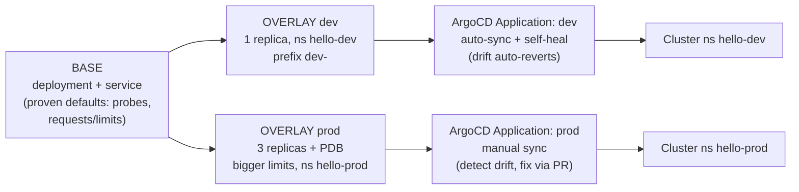

# ArgoCD + Kustomize GitOps — Minimal Working Example

A small, runnable demo of a common production GitOps pattern: **one Kustomize base, per-env overlays, ArgoCD watching the overlay paths.**

## The mental model

> "The base is the single source of truth for WHAT the app is. Overlays only declare HOW each environment differs — a patch, never a copy. ArgoCD points at the overlay path, so Git is the deploy interface: promotion is a PR that changes an overlay, and drift is anything the cluster does that Git didn't say."

## Diagram

**Mnemonic: "B-O-A — Base, Overlay, Application — the BOA constrictor that wraps your manifests."** Base = what, Overlay = how-per-env, Application = where ArgoCD delivers it.



## Layout

```
argocd-kustomize-example/
├── base/                      # WHAT the app is
│   ├── deployment.yaml        #   proven defaults: probes, requests/limits
│   ├── service.yaml
│   └── kustomization.yaml
├── overlays/
│   ├── dev/kustomization.yaml     # 1 replica, ns hello-dev, dev- prefix
│   └── prod/                      # 3 replicas, bigger limits
│       ├── kustomization.yaml
│       └── pdb.yaml               # prod-ONLY resource (minAvailable: 2)
└── argocd/
    ├── app-dev.yaml           # auto-sync + selfHeal (dev posture)
    ├── app-prod.yaml          # manual sync = audit-trail posture (GxP instinct)
    └── appset.yaml            # OPTIONAL: Git generator stamps an App per overlays/* dir
```

## Run it

Full walkthrough — prereqs, install (with the server-side-apply gotcha), UI access, the drift-detection and promotion-is-a-PR demos, **proof-it-runs screenshots**, and troubleshooting: **[HowToRun.md](HowToRun.md)**. Or just `./run-demo.sh`. Real issues hit during the first run are documented in [issues/issue.md](issues/issue.md).

## Design decisions

1. **Patch, never copy** — the base carries proven defaults (probes, requests/limits); overlays are diffs. No copy-paste divergence between envs.
2. **Sync posture per environment** — dev auto-heals; prod detects-and-alerts with fix-via-PR. That asymmetry is deliberate: in regulated environments the audit trail IS the feature.
3. **Prod-only resources** — the PDB exists only in the prod overlay. Same base, different operational guarantees.
4. **ApplicationSet as the scale-out** — the optional `appset.yaml` Git generator turns "add a QA env" into "add a directory." Cluster generator = WHERE, Git generator = WHAT, Matrix = both. (Hub-and-Spoke is this idea applied to platform add-ons across clusters.)
